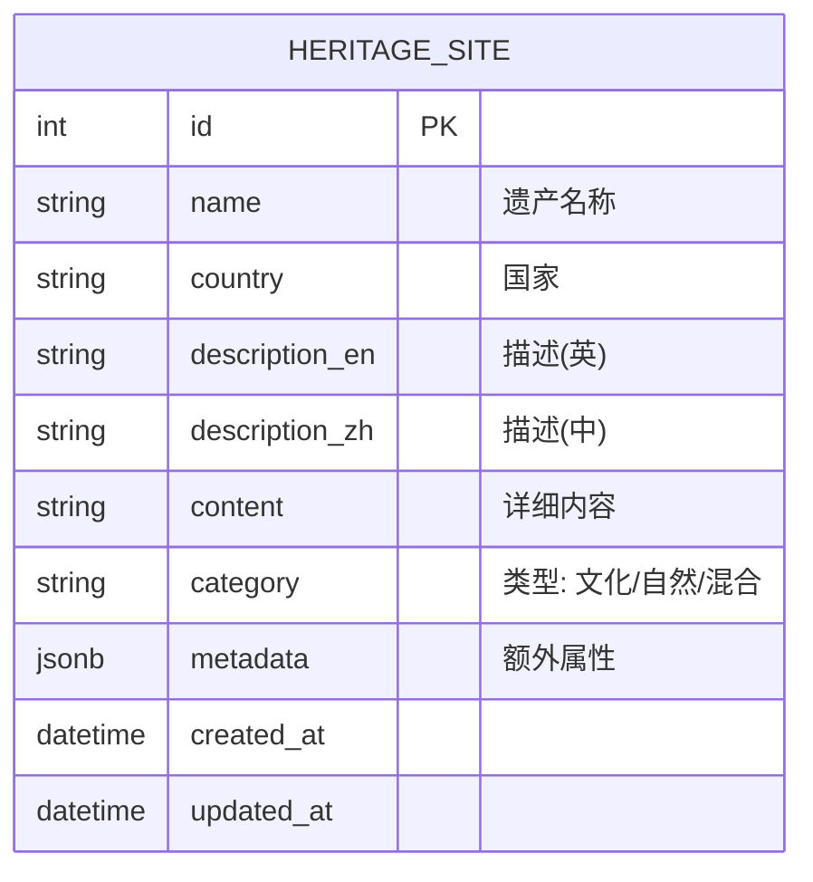

# 数据库设计说明书 (Database Design Document)

## 1. 引言
### 1.1 目的
本文档详细描述了“世界遗产数据系统”的数据库设计，包括关系型数据库 (PostgreSQL)、NoSQL 缓存 (Redis) 和向量数据库 (Chroma) 的设计。

### 1.2 范围
涵盖 `heritage_data` 核心表结构、爬虫去重队列设计以及 RAG 所需的向量集合结构。

## 2. 关系型数据库设计 (PostgreSQL)

### 2.1 ER 图
*(由于是一个单实体核心模型，实体关系较为简单)*

### 2.2 表结构定义

#### 表名：`heritage_site`
| 字段名 | 类型 | 长度 | 约束 | 说明 |
| :--- | :--- | :--- | :--- | :--- |
| **id** | SERIAL | - | PK | 自增主键 |
| **name** | VARCHAR | 255 | NOT NULL | 遗产名称 |
| **country** | VARCHAR | 100 | - | 所属国家 |
| **description_en** | TEXT | - | - | 详细描述 (英文) |
| **description_zh** | TEXT | - | - | 详细描述 (中文) |
| **content** | TEXT | - | - | 详细内容|
| **category** | VARCHAR | 50 | - | 遗产类型 (Cultural, Natural, Mixed) |
| **metadata** | JSONB | - | - | 扩展字段（如 source_url, tags 等） |
| **created_at** | TIMESTAMP | - | DEFAULT NOW() | 创建时间 |
| **updated_at** | TIMESTAMP | - | DEFAULT NOW() | 更新时间 |

### 2.3 索引设计
- **idx_heritage_country**: `ON heritage_site (country)` —— 加速国家筛选
- **idx_heritage_category**: `ON heritage_site (category)` —— 加速类型筛选

## 3. 缓存与队列设计 (Redis)

### 3.1 爬虫队列 (Scrapy Default)
- **Use Case**: Scrapy 请求去重和调度。
- **Key Pattern**: `crawler:requests` (ZSET), `crawler:dupefilter` (SET)
- **TTL**: 任务结束后可清理。

### 3.2 数据缓存
*(暂不启用)*

## 4. 向量数据库设计 (Chroma)

### 4.1 Collection 定义
- **Collection Name**: `heritage_knowledge_base`
- **Embedding Function**: Local LLM 对应的 Embedding 模型 (如 `all-MiniLM-L6-v2` 或其他本地模型)。

### 4.2 数据结构
Chroma 存储即包含 Document 和 Embeddings，Metadata 用于辅助检索。

| 字段 | 说明 |
| :--- | :--- |
| **ids** | 对应 PostgreSQL 中的 `id` (转为 string) |
| **documents** | 文本内容：包含名称、国家、描述的合并文本块。 |
| **metadatas** | `{"country": "China", "year": 1987, "category": "Cultural"}` |
| **embeddings** | 由 Local Model 生成的向量列表。 |

### 4.3 检索策略
- 使用 **Cosine Similarity** (余弦相似度) 进行 Top-K 检索。
- 检索时可使用 `where` 过滤条件（基于 Metadata）来缩小范围。
