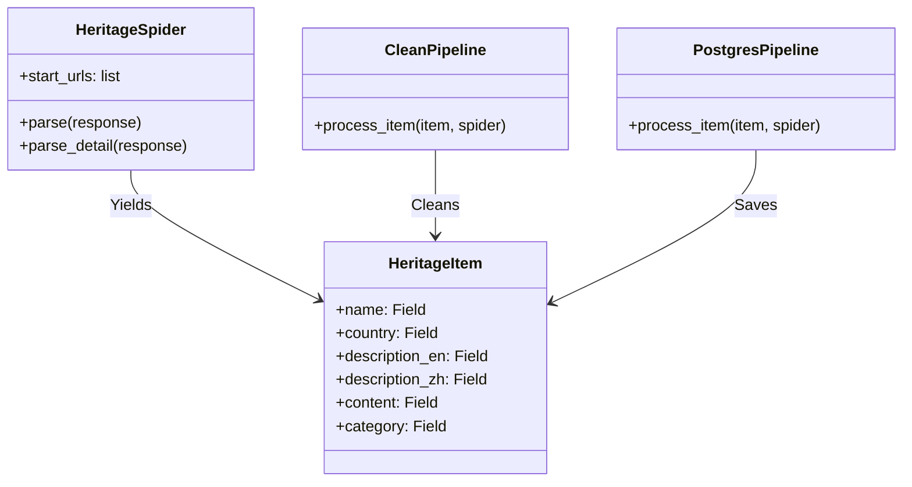

# 系统详细设计说明书 (Low-Level Design)

## 1. 引言
### 1.1 目的
本文档详细描述了“世界遗产数据系统”的核心模块实现细节，包括类设计、接口定义和关键算法逻辑。

### 1.2 范围
涵盖 `heritage_pipeline` (Scrapy), `heritage_display` (Django), `heritage_insights` (Local LLM + Chroma)。

## 2. 爬虫模块设计 (heritage_pipeline)

### 2.1 类图 (Class Diagram)


### 2.2 关键逻辑
- **Parse Strategy**: 
    1.  遍历列表页，提取详情页 URL。
    2.  进入详情页，通过 XPath/CSS 选择器提取字段。
- **Pipeline Flow**:
    1.  `CleanPipeline`: 清除 HTML 标签 (`w3lib.html.remove_tags`)，转换年份为整数。
    2.  `PostgresPipeline`: 使用 `SQLAlchemy` 将数据 Upsert (Insert on Conflict Update) 到数据库。

## 3. Web 展示模块设计 (heritage_display)

### 3.1 Django Models
```python
class HeritageSite(models.Model):
    name = models.CharField(max_length=255)
    country = models.CharField(max_length=100)
    description_en = models.TextField()
    description_zh = models.TextField()
    content = models.TextField()
    # ... (其他字段与 DBDD 一致)
    
    class Meta:
        indexes = [
            models.Index(fields=['country']),
            # ...
        ]
```

### 3.2 API 视图 (Views)
- **`HeritageListView`**:
    - Method: `GET /sites/`
    - Params: `country`, `category`, `year_min`, `year_max`
    - Logic: `HeritageSite.objects.filter(**params)`
- **`HeritageDetailView`**:
    - Method: `GET /sites/<id>/`
    - Logic: `get_object_or_404(HeritageSite, pk=id)`

## 4. 智能分析模块设计 (heritage_insights)

### 4.1 RAG 服务类 (RAGService)
```python
class RAGService:
    def __init__(self):
        self.vector_db = Chroma(collection_name="heritage_knowledge_base")
        self.llm = LocalLLMClient(model_path="...")

    def query(self, user_question: str) -> str:
        # 1. Retrieve
        results = self.vector_db.query(
            query_texts=[user_question],
            n_results=3
        )
        context = "\n".join([doc for doc in results['documents'][0]])
        
        # 2. Generate
        prompt = self.build_prompt(user_question, context)
        return self.llm.generate(prompt)

    def build_prompt(self, question, context):
        return f"""
        基于以下世界遗产信息回答问题。如果信息不足，请说明。
        
        [背景信息]:
        {context}
        
        [问题]:
        {question}
        """
```

### 4.2 向量化任务 (Offline Task)
- **Trigger**: 爬虫完成后或定期执行。
- **Logic**:
    1.  遍历 `HeritageSite` 表中 `updated_at` > `last_sync_time` 的记录。
    2.  拼接 `name` + `description`。
    3.  调用 Embedding 模型生成向量。
    4.  Upsert 到 Chroma。
